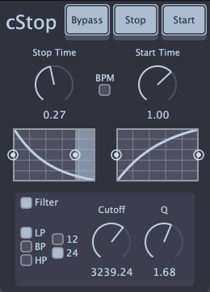

# cStop

<p align="center"></p>

cStop is a tape stop audio effect plugin available for Mac and Windows in VST3, CLAP, and AU formats.

## Version 2.0.0 Changes

> **⚠️ BREAKING CHANGES:** cStop v2 is not compatible with v1, meaning your previously saved DAW projects will be broken. If you have important projects using cStop v1, it is recommended to wait to upgrade until those projects are finished. You can always reinstall v1 via the [v1.0.1 Release](https://github.com/calgoheen/cStop/releases/tag/v1.0.1) if needed.

### What's New

- **Rewritten DSP:** Improved clarity and efficiency, now available in the [cgo_modules](https://github.com/calgoheen/cgo_modules/tree/main/cgo_processors/effects) repository
- **Modern UI:** Built with WebView using HTML, CSS, and TypeScript
- **Auto Bypass:** New parameter that automatically returns to bypass state after motion completes

## Download

Go to the [releases page](https://github.com/calgoheen/cStop/releases) to download the latest release installer.

- **Mac:** Use the installer with extension **.pkg**
- **Windows:** Use the installer with extension **.exe**

## Tips

- Automate the "Mode" parameter to trigger a tape stop/start at a specific point in your DAW timeline.
- Use the "Auto Bypass" option to automatically bypass the effect after the stop/start motion is complete.
- The crossfade and fade-out (stop) / fade-in (start) times can be adjusted via the parameter list in your DAW. These parameters will be added to the UI in a future update.

## Build Instructions

### Prerequisites

- [Node.js](https://nodejs.org/en)
- [CMake](https://cmake.org/)
- [Ninja](https://ninja-build.org/)

### Build

```
# Clone the repo
git clone --recurse-submodules https://github.com/calgoheen/cStop.git
cd cStop

# Configure and build
cmake --preset release
cmake --build --preset release
```

## Dependencies and Acknowledgements

- [JUCE](https://github.com/juce-framework/JUCE)
- DSP modules from [chowdsp_utils](https://github.com/Chowdhury-DSP/chowdsp_utils)
- CLAP plugin format is built with [clap-juce-extensions](https://github.com/free-audio/clap-juce-extensions)
- Thanks to [Jan Wilczek](https://github.com/JanWilczek/juce-webview-tutorial) for his very helpful JUCE WebView tutorial
